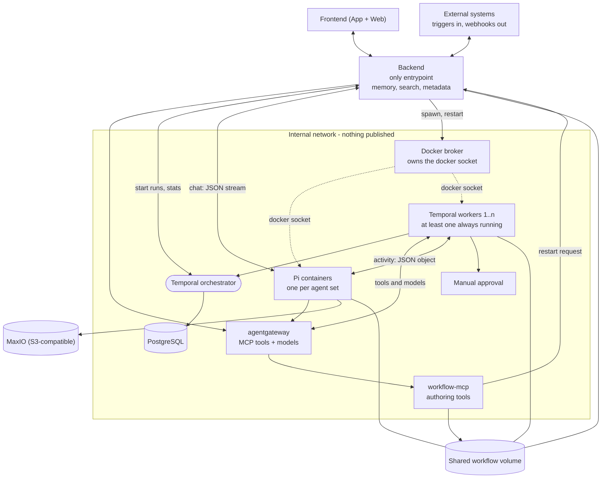

# agentic-flow

Handwritten notes and a sketch, turned into a spec. Nothing is built yet.

## What it is

A chat app where chats and workflows are the same thing. You talk to the system. When a conversation is something you want again, you say so — *"run this every day at 8"* — and the chat becomes a durable Temporal workflow on a schedule.

Workflows run agent steps through **Pi**, reach tools and models through **agentgateway**, and stream progress back to the frontend, so you always see the system working for you. The system can extend itself: promoting a chat writes real workflow code and puts it live without redeploying the stack.

## Architecture



Four rules the diagram encodes:

- The backend is the only service that publishes a port. Everything else stays on an internal network.
- Only the broker has the Docker socket. It offers fixed commands (`spawn`, `stop`, `restart_worker`), never a general "run this container".
- One shared volume holds the workflow files. Backend, workers and Pi containers all mount it.
- Triggers come in and results go out through the backend only.

## Components

| Component | What it does |
| --- | --- |
| **Frontend** | One Quasar (Vue 3) codebase, built as web (`-m spa`) and app (`-m capacitor`). The list is split into Chats and Workflows; every run appears as its own thread. |
| **Backend** | The only entrypoint: auth, triggers, webhooks, streaming to clients. Also memory, search and metadata in a PocketBase-like DB. Calls the broker, but does not hold the Docker socket. |
| **Docker broker** | Holds `/var/run/docker.sock`. Starts and stops Pi containers and restarts workers, using fixed commands and an image allowlist. |
| **agentgateway** | Upstream image, run as-is. One data plane for tools and models: federates MCP servers on `/mcp`, fronts OpenRouter on `/v1`, adds per-tool authorization and an audit trail. Config in [services/agentgateway/config/config.yaml](services/agentgateway/config/config.yaml). |
| **workflow-mcp** | Our own MCP server, registered behind the gateway. Provides the validated tools that create, update and delete workflow files. |
| **Pi containers** | The agent runtime ([Pi](https://pi.dev), `@earendil-works/pi-coding-agent`). One container per agent set. The base image is Node plus the Pi CLI; an agent set extends it with Pi extensions and packages. One set exists today; another set is another directory of the same shape. |
| **Temporal** | Orchestrator and workers. Durable runs, retries, schedules and history, stored in PostgreSQL. A workflow step can call MCP tools, invoke Pi, or run plain Python. |
| **Shared volume** | Where workflow files live. What an agent writes is what a worker loads. |
| **MaxIO** | S3-compatible object storage for payloads and artifacts. |

## Chats become workflows

A chat is the draft: interactive, streaming, temporary. A workflow is the saved version: durable, scheduled, repeatable. Turning one into the other is a normal user action.

Promotion does five things:

1. Read the transcript and find the repeatable steps.
2. Turn what was fixed in the chat (a date, a repo, a customer) into workflow inputs.
3. Convert interactive agent turns into activity steps with declared output schemas.
4. Write the workflow file and deploy it.
5. Attach a trigger: a Temporal schedule, a webhook, or another workflow.

Because this deploys code, the user approves the result before it is scheduled.

The deploy itself:

1. Pi calls an authoring tool in `workflow-mcp` through the gateway — not a shell. The operations are validated and deterministic, so the same request always produces the same file.
2. The file lands in the shared volume, so workers can see it immediately.
3. Pi asks for a worker restart. `workflow-mcp` tells the backend, the backend tells the broker.
4. The worker comes back with the new workflow registered, and the backend exposes it.

## Two ways Pi is called

| | Interactive | Activity |
| --- | --- | --- |
| Caller | Backend, for a user in a chat | A Temporal activity |
| Returns | A JSON stream | One complete JSON object |
| Shape | Free-form, rendered live | Structured output, checked against the schema the activity declares |

In activity mode an agent step is a typed function. A stream would be wasted there: nobody is watching, and the next step cannot read half a stream. If the model returns text instead of the declared object, the activity fails and Temporal retries it. Progress events still go to the backend in both modes.

## Scaling rules

| | Policy |
| --- | --- |
| Temporal workers | At least one always running. Never scale to zero, or triggers pile up with nothing to pick them up. |
| Pi containers | Scale to zero when idle, started on demand. |
| Agent set of a live workflow | Kept running, so that workflow never waits for a cold start. |
| Images | Built in advance. Runtime starts containers; it never builds them. |

## Layout

```
docker-compose.yml            every component; only the backend publishes a port
.env.example                  copy to .env; no secrets are committed
services/
  backend/                    entrypoint, management, calls the broker
  docker-broker/              owns docker.sock, fixed commands only
  agentgateway/config/        config for the upstream image
  workflow-mcp/               MCP server for workflow authoring
  worker/                     Temporal workers
  frontend/                   one Quasar codebase, web and app targets
images/
  pi-base/                    Node + the Pi CLI
  agent-sets/default/         the one agent set, with its extensions
infra/temporal/               Temporal server config
workflows/                    committed workflows, seeded into the volume
```

Networks: `edge` (published), `internal` (services, outbound allowed so the gateway reaches the model provider), `control` (backend to broker only), `data` (Temporal to Postgres only).

```
cp .env.example .env                    # fill in the secrets
docker compose --profile images build   # pi-base, then the agent set
docker compose up -d
```

## Open points

- **The broker is the trust boundary.** Keep it narrow. If it ever accepts a caller-supplied image, mount or environment variable, it is as dangerous as putting the socket in the backend.
- **An agent deploys code.** This needs a schema-validated write API, a diff a human can read, and approval before anything runs unattended.
- **Pi is a CLI, not a server.** Its container pattern is `ENTRYPOINT ["pi"]` on a mounted `/workspace`. Long-lived container with a job wrapper, or one process per call, is undecided — and it defines what "scale to zero" means.
- **Pi runs with full permissions.** The container is the only boundary. Pi's docs offer stronger options (Gondolin micro-VM, OpenShell) if that is not enough.
- **MaxIO states it is not production-ready.** Fine for now, and easy to swap for anything S3-compatible.
- **Concurrent writes** to the shared volume need locking.
- **Worker restarts** must let running activities finish instead of killing them.
- **All authentication sits in the backend.** Internal services trust the network.
- **Composable workflows** are still undefined: versioning, input and output schemas, permissions.
