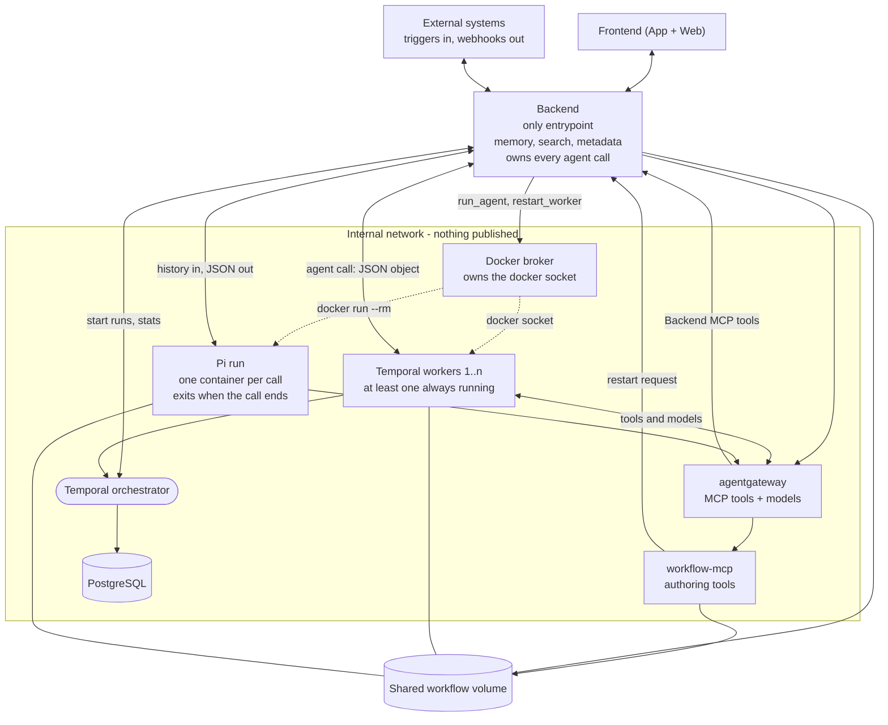

# Nautionette

[Site](http://nautionette.94.130.151.7.sslip.io) · [App](http://app.nautionette.94.130.151.7.sslip.io)

## What it is

A chat app where chats and workflows are the same thing. You talk to the system. When a conversation is something you want again, you say so — *"run this every day at 8"* — and the chat becomes a durable Temporal workflow on a schedule.

Workflows run agent steps through **Pi**, reach tools and models through **agentgateway**, and stream progress back to the frontend, so you always see the system working for you. The system can extend itself: promoting a chat writes real workflow code and puts it live without redeploying the stack.

Three things decide every trade-off below.

- **Extensible.** A new agent set, a new tool, a new validation step is a directory or a list entry — not a refactor.
- **Open.** Workflows are Python files you can read, edit and commit. Models and storage sit behind standard interfaces, so you can swap what is behind them.
- **Friendly.** The agent validates changes, verifies real runs, and reports diffs and outcomes without routine approval prompts.

## Architecture



Five rules the diagram encodes:

- The backend is the only service that publishes a port. Everything else stays on an internal network.
- Only the broker has the Docker socket. It offers fixed commands (`run_agent`, `restart_worker`), never a general "run this container".
- Every agent call goes through the backend, whether a user or a workflow asked for it. The broker answers to the backend and to nobody else.
- One shared volume holds the workflow files. Backend, workers and Pi runs all mount it.
- Triggers come in and results go out through the backend only.

## Components

| Component | What it does |
| --- | --- |
| **Frontend** | One Quasar (Vue 3) codebase built with Vite. `npm run build` produces the web bundle served here; Capacitor wraps the same `dist/` as the app. The list is split into Chats and Workflows; every run appears as its own thread. |
| **Website** | The promotional site. Static, its own container and its own domain, so the app and the pitch never share a deploy. |
| **Backend** | The only entrypoint: auth, triggers, webhooks, streaming to clients. Also memory, search and metadata in a SQLite store. Calls the broker, but does not hold the Docker socket. |
| **Docker broker** | Holds `/var/run/docker.sock`. Runs one Pi container per agent call (`docker run --rm`), builds missing agent images, and reconciles worker containers using fixed configuration and an image allowlist. |
| **agentgateway** | Upstream image, run as-is. One data plane for tools and models: federates MCP servers on `/mcp`, fronts every configured model provider on `/v1`, adds per-tool authorization and an audit trail. Its checked-in config is the baseline; the model integrations and MCP servers added in the app persist as runtime resources in its own SQLite volume. Config in [services/agentgateway/config/config.yaml](services/agentgateway/config/config.yaml). |
| **workflow-mcp** | Our own MCP server, registered behind the gateway. Provides validated workflow authoring, immediate deployment, run controls and history, plus the REST side the backend uses to publish files. |
| **Pi runs** | The agent runtime ([Pi](https://pi.dev), `@earendil-works/pi-coding-agent`). Pi is a CLI, so a call is a container run: start, work, exit. The base image is Node plus the Pi CLI plus `agent-run`, the wrapper that turns a job into NDJSON. An agent set extends it with Pi extensions and packages. |
| **Temporal** | Orchestrator and workers. Durable runs, retries, schedules and history, stored in PostgreSQL. A workflow step can call MCP tools, invoke Pi, or run plain Python. |
| **Shared volume** | Where workflow files live. What an agent writes is what a worker loads. Run artifacts land on their own volume, until there is an object store. |

## Chat delivery and recovery

Web and Android use the same thin client. The backend owns accepted messages,
active turns, partial text/tool timelines, and completed answers in SQLite.
Closing a tab, navigating away, or suspending Android does not stop an answer.
Each conversation has an authenticated reconnecting snapshot stream; opening it
on another device immediately recovers its current progress. Separate conversations
run concurrently, and the chat list shows which ones are answering.

The client keeps up to 100 full chat snapshots in IndexedDB, scoped to the instance
URL, plus the chat list. The latest 100 chats are downloaded in the background
with two concurrent requests while connected. Opening a conversation displays its
cached history and last known progress while reconnecting; fresh server snapshots
replace the cached view. Uncached conversations show a connection state instead of
a blank transcript. Cached active turns do not block queueing replies offline.
The backend remains authoritative for projects, models, tools, and other settings.
Local history depends on available device storage; storage failures show a warning.

A separate durable outbox holds messages not yet acknowledged by the server,
scoped to the instance URL. Cache eviction never removes queued messages. Messages appear immediately
as **Sending** with a clock; network errors, timeouts, busy chats, and server errors
retry with capped exponential backoff while the app is open. Reloading or resuming
the app resumes delivery. A stable `message_id` prevents a lost acknowledgement
from creating a duplicate turn. Acceptance briefly shows a checkmark; permanent
rejections remain visible with retry and discard controls. An unsent message cannot
appear on another device until a client successfully delivers it. Clearing app or
browser storage removes unsent messages. Creating a new chat requires connectivity.

`POST /api/chats/{id}/messages` accepts `{text, message_id, project_ids?, attachment_ids?, queue?}`. With
`Accept: application/json`, it returns `202` after durable acceptance; otherwise it
replays the turn's SSE events for compatibility. `GET /api/chats/{id}` and
`GET /api/chats/{id}/stream` expose the same recoverable snapshot, including
`active_turn`. The app sends `queue: true`: messages sent during a response are
persisted in the backend and shown under **Queued**, including after reconnecting
on another device. Pi receives compatible messages in order after its current
assistant turn's tool calls finish, before the next model request. Messages with
different model, tools, agent set, or project selections wait for a fresh container.
When a queued message is consumed, the preceding assistant text and tool steps are
saved before it as a separate reply. Live snapshots, reloads, and later turns keep
the conversation in that order rather than merging replies across queued inputs.
Unconsumed messages automatically start subsequent turns with updated history.
Only one container processes a chat at a time. Legacy clients omitting `queue`
still receive a retryable `409` for a busy chat. Queue requests return JSON `202`.

**Stop response** requests `POST /api/chats/{id}/stop` with `{turn_id}`. The broker
terminates that exact chat container (including running shell commands), or cancels
its pending startup. Partial output is retained, and queued messages are paused,
not discarded. Stop cannot undo tools' already-completed external side effects.
Use **Resume queued messages** (`POST /api/chats/{id}/queue/resume`) to continue;
idle queued messages can be removed with `DELETE /api/chats/{id}/queue/{message_id}`.
These controls require user authentication and are not exposed as MCP tools.

Interactive generation is independent of client connections, but is not a Temporal
workflow. On backend restart, unfinished turns retain their partial output and
become explicitly interrupted answers; pending messages remain queued and paused
until explicitly resumed. Tools are not automatically rerun because
their external side effects may already have happened. Run one backend process per
SQLite database; startup recovery assumes ownership of its unfinished turns.

Deploy chat controls by rebuilding/recreating the backend, Docker broker, frontend,
and Pi agent images. Chat containers use Pi RPC mode for live steering; workflow
agent calls retain their existing one-shot JSON mode. Validate the real runtime with
`NAUTIONETTE_DOCKER_TESTS=1 uv run pytest tests/broker/test_chat_control_docker.py`.

### Image attachments

Use **Attach images**, paste a screenshot, or drop images onto the composer. Preview,
expand, and remove attachments before sending; text is optional for image messages.
PNG, JPEG, GIF, and WebP are supported, with at most **four images per message**,
**5 MiB per image**, and **25 megapixels per image**. The backend checks image content
and MIME type; SVG and other file types are rejected. Known text-only models block
image messages; models with unknown capabilities show a warning rather than silently
dropping images.

Images upload before a message enters the durable outbox. Upload failures keep the
current draft for retry; successful uploads are reused. Uploading requires connectivity,
and unsent draft files do not survive page reload. Once uploaded, only attachment IDs
and metadata enter the outbox and transcript cache—not image bytes. Images in history
are fetched through authenticated endpoints, so offline snapshots retain text and
attachment metadata but cannot load images without a connection.

`POST /api/chats/{id}/images?name=...` accepts raw image bytes with their image
`Content-Type` and returns `{id, name, mime_type, size}`. Send the returned IDs as
`attachment_ids` with a message. `GET /api/chats/{id}/images/{image_id}` retrieves an
image; `DELETE` discards an upload only while it is unattached. Image bytes live in
SQLite separately from messages/events and are deleted with the message or chat.
Unattached uploads older than 24 hours are cleaned up on subsequent uploads.

Queued image messages wait for their own turn so steering cannot drop attachments.
Pi receives images through RPC; up to four recent history images are replayed alongside
current attachments, subject to the history budget. Older omitted images are marked
in the prompt. Large agent jobs use a private file copied into the container rather
than exceeding Linux environment-variable limits. Deploy this feature by rebuilding
the backend, Docker broker, frontend, and Pi images together.

### Agent runtime limits

Chat turns default to a one-hour wall-clock limit (`AGENT_RUN_TIMEOUT_SECONDS=3600`),
including tool execution and time waiting for internet approval. The same setting
is passed to **both backend and Docker broker**: the backend requests this budget,
and the broker enforces it even when the agent produces no output. Recreate both
services after changing it. Existing deployments explicitly configured with `900`
retain their 15-minute limit until that environment value is updated; an already
running turn keeps its original budget.

Workflow agent calls still default to 900 seconds. For longer calls, set the
activity's `timeout_seconds`, increase its Temporal `start_to_close_timeout` and
workflow timeout as needed, and ensure the broker ceiling is at least as large.

A watchdog expiry is reported as a **time limit**, Docker-confirmed OOM as **out of
memory** (with `AGENT_MEMORY_LIMIT`, default `1g`), and other exit-137 failures as
**SIGKILL with an unconfirmed cause**. Exit 137 alone is not evidence of OOM.
Failed turns retain their partial transcript and persistent project worktrees;
continue with a new message rather than automatically replaying tools that may
already have produced external side effects.

### Session internet approval

Chat Pi containers start on `nautionette-agents`, a Docker `internal: true`
network with access to the model/tool gateway but no direct internet route or
connection to the backend and broker networks. Before fetching websites, cloning
remote repositories, or downloading packages, Pi calls `request_internet_access`
with its reason. The chat displays **Allow for this chat** and **Deny**, and the
tool waits while the current turn remains active. Pending requests survive client
reloads and reconnects, up to the configured agent-run timeout.

The user decision endpoint is `POST /api/chats/{id}/internet` with
`{turn_id, allowed}`. It is not an MCP tool. Only an authenticated user decision
for a pending, running turn lets the broker attach its container to the separate
`nautionette-agent-egress` network. The broker then delivers the decision to the
waiting tool. Chat containers have no service credential or network-admin
capabilities; the tool's local decision file is a notification, not authority to
change networking.

Approval is persisted on the chat in SQLite and applied before starting every
subsequent turn's container. It is not shared with other chats or workflows.
Denial remains in effect for that chat; a new chat starts blocked. Unanswered
requests are cleared when a turn ends or the backend restarts. Here, a session
means the lifetime of the chat, not the browser tab or an individual Pi process.

This controls **direct Pi egress**, not server-side internet use by configured
MCP tools, model providers, or workflow activities. Those remain trusted system
capabilities and are not sandboxed by this gate. Configure distinct `APP_TOKEN`
and `INTERNAL_TOKEN` values for shared deployments.

After updating, rebuild/recreate backend, docker-broker, frontend-web, and
agentgateway with `docker compose up -d --build backend docker-broker frontend-web agentgateway`.
The broker rebuilds the changed Pi base and agent images automatically. The new
networks and images must be in place before using the gate; already running agent
containers are not retroactively restricted.

Focused checks: `uv run pytest tests/backend/test_internet.py tests/broker/test_internet.py`,
`npx --yes tsx --test tests/agent/*.ts`, and
`npm --prefix services/frontend run test:e2e -- chat.spec.js --grep internet`.
The opt-in isolation check uses a local `node:24-bookworm-slim` image and temporary
containers/networks, cleaned up afterward:
`NAUTIONETTE_DOCKER_TESTS=1 uv run pytest tests/broker/test_internet_docker.py`.

## GitHub Projects

Settings > Projects connects a GitHub App installation and downloads selected
repositories into the persistent `nautionette-projects` Docker volume. The folder
picker beside the model and tool selectors chooses which projects a message exposes.
Selections are captured in the durable outbox and saved with the accepted message;
retries cannot silently change that selection.

### App Setup

1. Open Settings > Projects and choose **Connect GitHub**. The public HTTPS instance
  URL is prefilled when possible. Select a personal account or enter an organization.
2. Confirm the App registration on GitHub, then select the repositories it can access.
3. GitHub returns to Projects automatically. Add repositories from the installation list.

The App manifest registers the webhook and callback URLs, Contents/Workflows write
permissions, and Metadata read access. GitHub generates the private key and webhook
secret; Nautionette exchanges the registration code server-side. No IDs or PEM uploads
are needed. An unfinished registration can resume with **Complete installation**;
organization approval may be required. **Repository access** reopens GitHub's chooser.

GitHub must reach the instance over HTTPS. For local development, use a public HTTPS
tunnel to the web frontend (including its `/api` proxy); localhost alone cannot receive
webhooks. Set `GITHUB_APP_PUBLIC_URL=https://nautionette.example.com` in Compose to
preconfigure the URL, or enter it in Projects. Use the same stable public origin for
the frontend and backend callbacks. Behind an extra authentication proxy, allow the
`/api/projects/github-app/start`, `/callback`, `/installed`, and `/webhook` paths:
callbacks validate single-use setup state and a Secure HttpOnly browser cookie;
webhooks validate GitHub's HMAC-SHA256 signature. The `/connect` endpoint remains
user-authenticated. Setup links expire after one hour. Returning on another device or
browser requires starting setup again; existing registration credentials are retained.

Signed lifecycle webhooks invalidate cached installation access after repository or
installation changes. Repository rename/default-branch events update metadata; push
events never reset, pull, or overwrite chat worktrees. Duplicate deliveries are ignored
for seven days and request bodies are limited to 2 MiB. The connection status shows the
last accepted webhook. Existing manually configured Apps remain usable; they can be
upgraded by connecting an automatically registered App.

The private key is stored in the backend's SQLite settings, never returned by the API
or placed in an agent. The webhook secret is also backend-only. Protect the
backend-data volume and its backups, configure `APP_TOKEN` and `INTERNAL_TOKEN`, and
use HTTPS outside local development. The App belongs to your GitHub account or
organization; this is App registration, not a third-party OAuth service.

### Per-Chat Worktrees

The initial checkout is a repository cache. Every chat gets its own persistent Git
worktree, exposed to its agent at `/projects/<project-id>`. Its working files live in
`.sessions/<project-id>/<chat-id>` in the projects volume. Only selected repositories'
Git metadata and that chat's working files are mounted. Two chats can edit and commit
on the same repository concurrently without sharing an index or HEAD.

Worktrees start at the locally cached default-branch commit with **detached HEAD**; no chat
branch is created. Empty repositories get a local empty initial commit. Later turns
reuse the existing HEAD, staged changes, and uncommitted files without resetting or
pulling. Removing a project or deleting a chat does not delete its worktree or commits.
Worktrees are locked against Git's automatic pruning. These are collaboration
workspaces, not a security boundary between mutually untrusted agents: Git objects,
refs and repository configuration are shared, and committed content may be visible
to other chats that select the same project.

To publish a detached commit, choose the target explicitly, for example
`git push origin HEAD:refs/heads/main`. The agent asks when the target is unclear.
Concurrent pushes to the same target can be rejected as non-fast-forward; fetch and
reconcile those changes, never force-push to bypass them. GitHub branch protection
and App permissions still apply. Git LFS, submodule authentication, and GitHub
Enterprise hosts are not part of this integration.

There is no Git proxy or extra Git service. Worktree setup is offline. Agents request
the existing chat internet approval before contacting GitHub, then use normal Git
fetch/pull/push directly against the HTTPS origin. The backend supplies fresh,
repository-scoped installation tokens for each turn through a Git credential helper.
Tokens are not saved in Git config or job files; they expire within one hour and are
revoked when the turn ends (best effort, including failure cleanup). A new message
obtains fresh tokens. Agents receive these short-lived tokens, never the App private
key, and must not print or persist credentials. Internet denial leaves local editing
available but prevents fetching or pushing. The initial repository download from
Settings runs on the backend, not inside an agent.
Project management is user-only and is not exposed through backend MCP.

### Deployment

Docker Engine 26+ (API 1.45+) is required for volume-subpath mounts. Rebuild/recreate
the changed services with:

```sh
docker compose up -d --build backend docker-broker frontend-web
```

The backend and broker must mount the same named projects volume at `/projects`
(read-only in the broker). The broker discovers the actual volume name from its
own Docker mount metadata, including deployment-platform prefixes; `PROJECTS_VOLUME`
is no longer used. Keep Docker's default container hostname so the broker can inspect
itself. No checkout migration or re-download is needed when a platform prefixes the
volume name.

The broker rebuilds the changed Pi images automatically. Project agents run as UID
10001, matching the backend, with capabilities dropped. Custom agent sets must keep
their image-provided Pi configuration readable so it can be copied into `/workspace`.

Checks: `uv run pytest tests/backend/test_projects.py tests/backend/test_github_setup.py
tests/broker/test_projects.py`, `node --test tests/agent/test_project_git.mjs`, and
`npm --prefix services/frontend run test:e2e -- projects.spec.js`. The opt-in Docker
check is `NAUTIONETTE_DOCKER_TESTS=1 uv run pytest tests/broker/test_projects_docker.py`;
it uses a local `nautionette/pi-base:dev` image and removes its temporary resources.

## Chats become workflows

A chat is the draft: interactive, streaming, temporary. A workflow is the saved version: durable, scheduled, repeatable. Turning one into the other is a normal user action.

Promotion does five things:

1. Read the transcript and find the repeatable steps.
2. Turn what was fixed in the chat (a date, a repo, a customer) into workflow inputs.
3. Convert interactive agent turns into activity steps with declared output schemas.
4. Write the workflow file and deploy it.
5. Attach a trigger: a Temporal schedule, a webhook, or another workflow.

There is no mandatory draft or approval step. The agent deploys validated code, runs it with relevant inputs, inspects results, and repairs failures without routine permission questions. Scheduling still follows the user's requested task.

The deploy itself:

1. Pi calls an authoring tool in `workflow-mcp` through the gateway — not a shell. The operations are validated and deterministic, so the same request always produces the same file.
2. The backend asks workflow-mcp to validate and atomically replace the live file on the shared volume. Invalid code leaves the previous version untouched.
3. The backend publishes the change event and asks the broker to reload workers. The deployment response includes its diff, validation report, and worker restart status.
4. The agent starts a run, inspects its history and results, and fixes/redeploys errors. A started run is not reported as successful until the result confirms it.

### Backend MCP

The backend exposes streamable HTTP MCP at `/mcp/`, authenticated with a bearer
`INTERNAL_TOKEN` or `APP_TOKEN`. With both tokens empty it follows the app's open
development mode; configure tokens for a shared deployment. At startup it probes
its own endpoint and registers an authenticated `backend` target in agentgateway,
so tools arrive as `backend_<operation>` without manual setup. `BACKEND_MCP_URL`
defaults to `http://backend:8080/mcp/` and must be reachable from agentgateway.

Tools are generated from the existing backend API schemas and dispatch through the
same routes and validation as the app. They cover system health, recent events,
workflow validation/deployment/settings/schedules, runs and execution history,
worker restarts, model integrations, and MCP server configuration. For example:
`backend_system_status`, `backend_deploy_workflow`, `backend_run_workflow`,
`backend_read_run`, and `backend_restart_workers`. JSON request bodies are passed
as the tool's `body` argument. Mutations emit audit events without their credentials
or request payloads.

The workflow tools also support this loop directly: `workflows_write_workflow`
deploys and reloads workers, `workflows_run_workflow` starts a run, and
`workflows_read_run` reports its results and failures. Check `ready` and
`worker_restart` after deployment; reload failures are returned, not hidden.
Backend source-code rewriting, arbitrary shell/proxy access, and recursive chat
invocations are not exposed. Existing drafts remain available for compatibility,
but new agent writes and chat promotions deploy directly.

## Workflows are Python files

A workflow is a plain Python module against the Temporal Python SDK, with a manifest at the top. No bespoke DSL and no database row: what an agent writes is what a person reads, edits and reviews.

```python
MANIFEST = {
    "schema": 1,
    "name": "daily-repo-digest",
    "inputs": {"type": "object", "properties": {"repo": {"type": "string"}}},
    "outputs": {"type": "object", "properties": {"summary": {"type": "string"}}},
    "agent_set": "default",
}
```

Where the files live:

| Stage | Where |
| --- | --- |
| Today | The shared volume. `workflows/` in this repo is the seed, copied in on first start. |
| Next | The volume as a git checkout: author anywhere, push, the backend pulls and restarts the worker. |

Git is the reason a workflow is a file at all. Nothing in the design assumes an agent wrote it — a workflow typed by hand in an editor and pushed from a laptop takes exactly the same path through validation and deploy.

### Interactive flow views

Workflows open on **Flow**. The definition diagram shows activities, child workflows,
conditions, loops, timers, parallel groups, and returns without executing the source.
Select a node to inspect its source; pan, zoom, search, or change the layout direction.
Run controls, code, and history remain in their own tabs.

Loops have a header and a dashed enclosure around their body, including nested
loops. `continue` and `break` appear as **Next iteration** and **Exit loop**, without
loop-back arrows crossing the body. Groups retain their structure in revision comparisons.

Built-in activity nodes show agent sets and prompts, MCP servers/tools/arguments,
HTTP methods and URLs, event payloads, and artifact filenames/content. The inspector
adds output schemas, timeouts, and retry policies when present. Source expressions
are marked explicitly and never evaluated; runtime defaults are not guessed.
Agent run results show the actual tools used when that information is recorded.

Select a run from the flow source menu, or open **Runs**, for observed Temporal history.
Active runs refresh every three seconds while the page is visible. Nodes carry real
execution states, retry attempts, durations, inputs, results, and failures. Refreshes
preserve the camera and selection. The active step opens in view on short screens;
node details become a bottom sheet on mobile.

Legacy drafts open with a visual comparison: green additions, amber changes, and dashed red
removals, including changed connections. **Proposed**, **Deployed**, and **Code diff**
remain available for inspection and deployment. Changes outside diagrammed steps are reflected on
the workflow node and in the code diff.

Definition diagrams are structural previews, not a Python execution engine. Helper
calls, dynamic expressions, and complex exception handling stay as source blocks;
warnings flag partial diagrams. Run diagrams cover ordinary activities, child workflows,
timers, and received signals in a single execution, with edges based on observed command
and completion order, not inferred data dependencies. Local activity markers and child
execution internals are not expanded; child nodes link to their own run. History is
capped at 2,000 relevant events with an explicit warning, and payloads use the history
reader's existing truncation limits. A lost connection leaves the last graph visible
and marks updates as paused.

Frontend verification (from the repository root):

```sh
npm --prefix services/frontend ci
npm --prefix services/frontend test
services/frontend/node_modules/.bin/playwright install chromium
npm --prefix services/frontend run test:e2e
npm --prefix services/frontend run build
```

The browser tests use mocked API responses and the real Python graph builders via
`uv`, so the workspace's Python dependencies must also be installed. They do not
start workflows or require a running Temporal server.

## The authoring schema

An agent that writes code needs a narrow door. `workflow-mcp` is that door: every tool takes JSON-Schema-validated arguments, and every write runs the same checks, no matter whether Pi, the frontend or a future git sync asked for it.

| Tool | Does |
| --- | --- |
| `list_workflows` | Names, manifests, versions. |
| `read_workflow` | The current file. |
| `validate_workflow` | Runs the checks below and writes nothing. |
| `write_workflow` | Validates, deploys, reloads workers, and returns a diff and status. |
| `run_workflow` | Starts a deployed workflow with its input; returns a workflow ID. |
| `list_runs` / `read_run` | Finds runs and inspects progress, errors and final results. |
| `delete_workflow` | Removes a file. Run history stays in Temporal. |

The checks, in order:

1. Tool arguments against the tool schema.
2. Manifest against the workflow schema — name, `schema` version, input and output schemas, agent set.
3. The file parses, imports in a throwaway subprocess, and registers with the Temporal SDK.
4. Validated source is deployed atomically. The agent receives the diff and reload status, then tests the workflow and inspects results without an approval gate.

Extensible on purpose: the manifest schema is versioned and additive, unknown keys prefixed `x_` are preserved instead of rejected, and a new rule is a new step in that list. It is deliberately not a policy engine — good enough to stop broken code, cheap enough to change.

## Two ways Pi is called

| | Interactive | Activity |
| --- | --- | --- |
| Caller | Backend, for a user in a chat | A Temporal activity, through the backend |
| Returns | A JSON stream | One complete JSON object |
| Shape | Free-form, rendered live | Structured output, checked against the schema the activity declares |

In activity mode an agent step is a typed function. A stream would be wasted there: nobody is watching, and the next step cannot read half a stream. If the model returns text instead of the declared object, the activity fails and Temporal retries it. Progress events still go to the backend in both modes.

Both modes get a fresh container, so context is always passed in, never remembered:

- In a chat the backend hands over the conversation history it already owns.
- In a workflow the workflow decides what to hand over — the full history of a run, a summary, or nothing but the typed inputs. That choice is workflow code, visible in the file and replayable by Temporal.

The container contract is one environment variable in and NDJSON out. `AGENT_JOB` carries a
base64 JSON job; `agent-run` renders the prompt, runs `pi --mode json`, and translates Pi's event
stream into `delta`, `tool`, `error` and a final `result` line. Nothing else crosses the boundary.

## Scaling rules

| | Policy |
| --- | --- |
| Temporal workers | At least one always running. Never scale to zero, or triggers pile up with nothing to pick them up. |
| Pi | Always zero between calls. One `docker run --rm` per call, gone when the call returns — including for pinned or busy workflows. |
| State | Nothing survives in a Pi container. History, inputs and the workspace are handed in at start; results come back as JSON. |
| Images | Built in advance and checked periodically. If cleanup removes one, it is rebuilt; a call arriving during recovery waits for the build. |

### Execution health and recovery

The broker checks Docker at startup and every `CONTAINER_RECONCILE_SECONDS` (default: 30).
It rebuilds missing Pi base and agent-set images, restores the base-image alias, starts stopped
workers, restarts unhealthy workers with the configured drain timeout, and recreates deleted
workers up to `WORKER_REPLICAS` (minimum: one). Failures are reported and retried on later passes.
All worker operations are scoped to the broker's own Compose project.

Every worker loads all workflow files on the configured Temporal task queue; separate containers
per workflow are unnecessary. A Docker readiness probe checks a fresh worker heartbeat, successful
workflow loading, and whether the loaded source files still match the shared volume. Changed files
therefore trigger recovery even if the explicit deploy-time restart was missed. Invalid workflows
remain degraded until their code or dependencies are fixed; recovery cannot repair workflow code.

`/api/system` exposes the broker's live image status, missing images, desired/ready worker counts,
container states, and readiness errors. An HTTP-successful but degraded broker is not shown as healthy.
Pi containers themselves remain intentionally ephemeral: there is no idle Pi container to keep alive.

Recovery is eventual, not uninterrupted availability: allow for the reconciliation interval, image
builds, dependency installation, and worker startup. Worker probes run every 10 seconds, require
three failed checks, and allow 360 seconds for initial dependency installation. Docker and the broker
must remain running; the worker image must be locally available or pullable. Recreated workers use
the fixed image, environment, network, and volume configuration in the broker, not arbitrary container
arguments. Custom deployments must keep those settings aligned with their worker configuration.

Deploy these checks with `docker compose up -d --build worker docker-broker backend`. Compose starts
workers before the broker and stops the broker first on stack shutdown. Stop the broker before
intentionally stopping or removing individual workers for maintenance, or it will restore them.

### Container health checks (Coolify)

Every long-running service declares a Docker health check. Checks for our built images live in
their Dockerfiles; PostgreSQL and the optional debug Temporal UI declare theirs in
`docker-compose.yaml`. Coolify's Docker Compose build pack uses these declarations, so no duplicate
health check needs to be configured in its UI.

| Service | Check |
| --- | --- |
| Backend, workflow MCP | Local HTTP `/healthz` endpoint |
| Docker broker | Local `/healthz` response must report `status: ok`, including execution readiness |
| Worker | Fresh heartbeat, loaded workflows, and matching source files |
| Frontend web, website | Local Nginx root page returns HTTP success |
| agentgateway | Native readiness endpoint at `http://127.0.0.1:15021/healthz/ready` |
| Temporal | `temporal operator cluster health` against `127.0.0.1:7233` |
| PostgreSQL | `pg_isready` |
| Temporal UI (`debug` profile) | Local HTTP root page on port 8080 |

The gateway image includes a static BusyBox executable for its probe because the upstream image
has no shell. Gateway readiness does not make a model call or require provider credentials.
Probe ports stay private; they do not need to be published for Coolify. Build-only Pi images and
short-lived agent runs intentionally have no service health check.

Rebuild and redeploy the stack in Coolify to apply changed checks. Locally, use
`docker compose up -d --build` and inspect the results with `docker compose ps`. Restarting an
existing container alone does not apply new image health-check metadata. Allow for the configured
startup grace periods, especially Temporal database setup and worker dependency installation.

Health checks report container status; they do not themselves restart an unhealthy process.
The broker recovers unhealthy workers as described above. For other services, `restart: unless-stopped`
restarts exited containers, not containers whose only failure is an unhealthy status.

## Layout

```
docker-compose.yaml            every component; only the backend and the site publish a port
pyproject.toml / uv.lock      one uv workspace for every Python service
.env.example                  copy to .env; no secrets are committed
libs/nautionette/             manifest schema and source helpers, shared by the services
services/
  backend/                    entrypoint, management, calls the broker
  docker-broker/              owns docker.sock, fixed verbs only
  agentgateway/config/        config for the upstream image
  workflow-mcp/               MCP + REST server for workflow authoring
  worker/                     Temporal workers
  frontend/                   one Quasar codebase, web and app targets
  website/                    the promotional site
images/
  pi-base/                    Node + the Pi CLI + the agent-run contract
  agent-sets/default/         the one agent set: gateway provider + MCP tool bridge
infra/temporal/               Temporal server config
tests/                        one pytest suite over every Python service
workflows/                    Python workflow files, seeded into the volume
```

Every Python service ships one distinctly named package — `nautionette_backend`,
`nautionette_worker`, `nautionette_workflow_mcp`, `nautionette_docker_broker` — so all
four can be installed into the one workspace venv without shadowing each other.

The backend is the largest of them, and is laid out by what each file is about:

```
services/backend/nautionette_backend/
  main.py            assembles the app and nothing else
  config.py          the environment, read once
  security.py        the bearer token and the internal token
  db.py              SQLite storage, and the one connection
  events.py          the in-process fan-out behind /api/events
  runtime.py         saved settings, the history budget, the catalog cache
  fields.py          declared form fields, and checking a payload against them
  gateway_config.py  writing to agentgateway's own config store
  catalog.py         which models and tools exist, and who serves each one
  mcp_servers.py     MCP targets: probe, write, remove
  runs.py            starting a run, following it, delivering its result
  clients/           one module per service this one talks to
  agent/             prompts, one agent call, and chat promotion
  integrations/      the provider registry, and what it becomes in the gateway
  routers/           the HTTP surface, one router per thing
```

Networks: `edge` (published), `internal` (services, outbound allowed so the gateway reaches the model provider), `control` (backend to broker only), `data` (Temporal to Postgres only).

## Run it

```
cp .env.example .env                    # provider keys, POSTGRES_PASSWORD, APP_TOKEN
docker compose up -d
```

The backend answers on `${BACKEND_PORT}` and the site on `${WEBSITE_PORT}`, both bound to
loopback. The broker builds `pi-base` and every agent set on first start; until that finishes,
`/api/system` reports the agent sets as not ready and says so in the UI.

Model providers are managed under **Settings > Agents > Model integrations**: pick one from the
list, add it, test it, and remove it again. OpenRouter, GitHub Copilot, OpenAI, Anthropic, Groq,
Mistral, DeepSeek and xAI ship as entries in one registry, and **Custom** covers any other endpoint
that speaks the OpenAI chat completions API. Every integration becomes an agentgateway route, so
they all behave the same way; OpenRouter is added automatically on first start for continuity.

Nautionette never stores a model list. It asks each provider what it serves — OpenRouter and custom
endpoints through their own catalog, Copilot through the authenticated account — and labels every
entry in the pickers by both integration and model vendor. A prefixed integration wins over the
OpenRouter wildcard for its own namespace, so `openai/*` goes direct once OpenAI is configured.

Credentials never touch this codebase. Paste a provider's API key into the integration form and
agentgateway keeps it in the `agentgateway-data` volume; the backend writes it once and never reads
it back to a client, so a phone is enough to add a provider. To hold keys in the environment
instead, put them in `.env`, recreate the gateway with
`docker compose up -d --force-recreate agentgateway`, and type `$OPENAI_API_KEY` (or whichever
variable) into the same field. Either way the secret stops at agentgateway.

Working on the Python services:

```
uv sync                                 # one workspace, one lock file
uv run pytest                           # every service, no Docker and no network
uv run ruff check . && uv run ruff format .
uv run --package nautionette-backend uvicorn nautionette_backend.main:app --reload
```

The suite in `tests/` covers all four services. Everything outside a process is faked:
agentgateway keeps its config resources in a dict, the broker replays a canned agent
stream, Temporal is a dictionary of executions, and outgoing HTTP is answered from a
routing table. So `uv run pytest` needs nothing running and finishes in seconds.

```
tests/backend/        the API surface, plus the modules behind it
tests/broker/         image tagging, the fixed verbs, the restart scoping
tests/worker/         the activities a workflow may name, and loading workflow files
tests/workflow_mcp/   the store, the check chain, the REST face
tests/lib/            the manifest schema and the source reader
```

The one test that needs a subprocess is the workflow import check; it is marked `slow`
and runs by default, since the committed workflows are validated with the real chain.

## Open points

- **Pi runs with full permissions.** The container is the only boundary. One container per call shortens the window but not the blast radius; Pi's docs offer stronger options (Gondolin micro-VM, OpenShell) if that is not enough.
- **Worker restarts** must let running activities finish instead of killing them. A stop grace period is a start, not a proof.
- **All authentication sits in the backend.** Internal services trust the network.
- **Git sync** needs a conflict story: what happens when a push and an agent write touch the same file.
- **Composable workflows.** Inputs and outputs are covered by the manifest; one workflow calling another still needs versioning and permissions.
- **Object storage.** The boundary is S3-shaped, but there is no store behind it yet — MaxIO is not ready, so artifacts stay on the shared volume.
